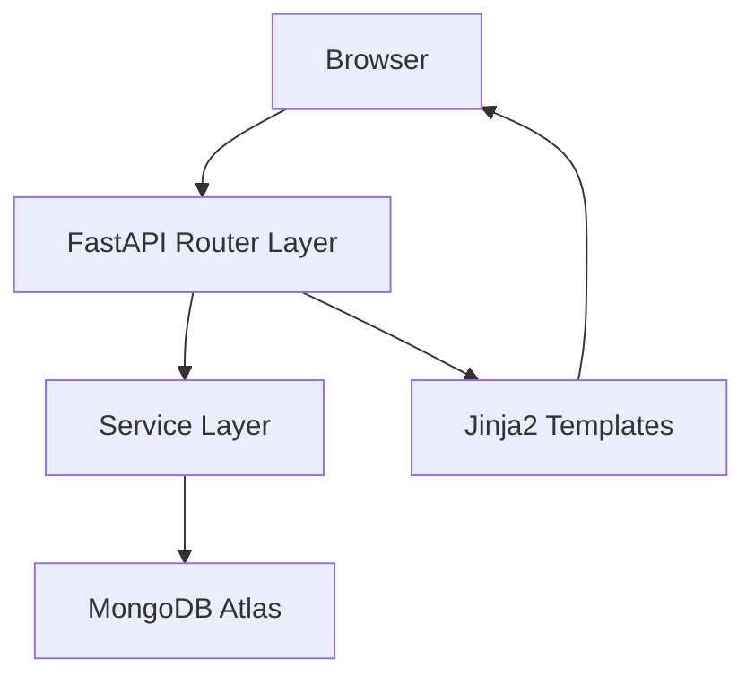
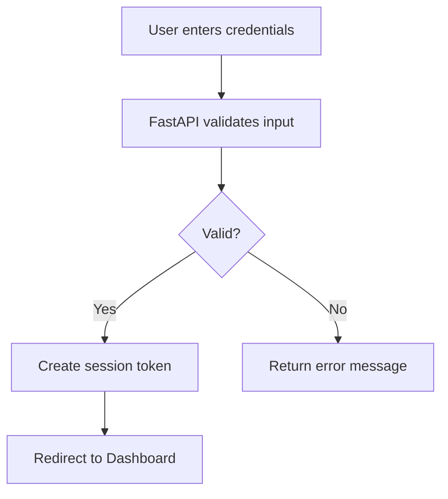
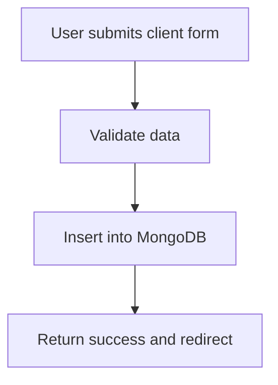
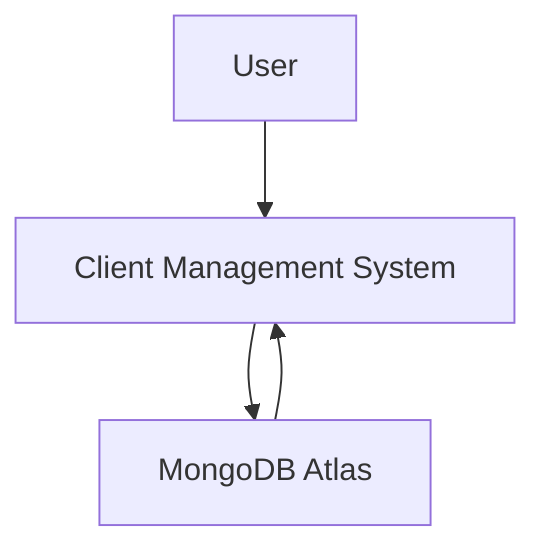
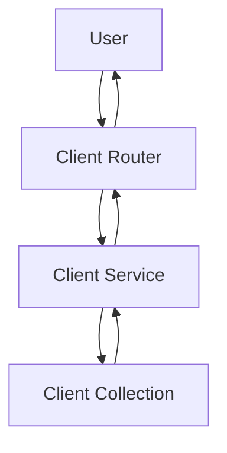

# Client Management System

## INTRODUCTION

### Executive Summary

The Client Management System (CMS) is a web-based business automation solution designed to manage client profiles, transactions, payments, and invoices. It offers a secure authentication mechanism and a real-time dashboard to streamline operational workflows.

### Purpose

The system centralizes client and financial data while reducing manual workload, increasing transparency, and improving business efficiency.

### Target Audience
- Small to medium businesses
- Agencies
- Freelancers
- Service-based companies

### Scope
- Core workflow includes:
- Client CRUD
- Transaction entry
- Payment logs
- Invoice generation
- Search & filtering
- Analytics dashboard

---

## TECHNOLOGY STACK

- Backend
    - FastAPI (Python)
    - Motor (async MongoDB driver)
    - Jinja2 (templating)

- Frontend
    - HTML
    - TailwindCSS
    - Vanilla JavaScript

- Database
    - MongoDB Atlas (Cloud managed NoSQL)

---

## SYSTEM FEATURES OVERVIEW
- Client Management: Create, read, update, delete client profiles.
- Transaction Management: Add financial transactions with date, amount, and purpose.
- Payment History: Track payment logs per client.
- Invoice Generation: Generate printable invoices dynamically using HTML templates.
- Authentication: Login system with hashed passwords (Passlib).
- Search + Filters: Search by name and phone. Filtered by payment status

---

## SYSTEM ARCHITECTURE

### Architecture Diagram



### Layer Description
- Router Layer: Handles HTTP requests
- Service Layer: Business logic
- Repository Layer: MongoDB operations
- Template Layer: HTML rendering

---

## PROJECT FLOWCHARTS

### Login Flow



### Client Creation Flow



---

## DATA FLOW DIAGRAMS

### DFD Level 0



### DFD – Client Module



## File Structure

```bash
ClientManagement/
├── .gitignore
├── requirements.txt
├── main.py                    # FastAPI app & auth setup
├── database.py                # MongoDB (pymongo) connection
├── models.py                  # Pydantic models (Client, User, Transaction)
├── security.py                # Password hashing, JWT, login logic
├── routers/
│   ├── auth.py                # login/logout
│   ├── clients.py             # CRUD: /add, /view, /pending, /completed
│   └── transactions.py        # /transaction (update payment)
├── templates/
│   ├── base.html              # Layout with sidebar & your color palette
│   ├── login.html
│   ├── admin.html             # Dashboard (matches your image)
│   ├── add_client.html
│   ├── view_clients.html
│   ├── pending.html
│   ├── completed.html
│   └── transaction.html
└── static/
    └── style.css              # Tailwind via CDN + custom overrides (fonts, colors)
```

Author: Tushar Shihab <br>
Machine Learning Engineer