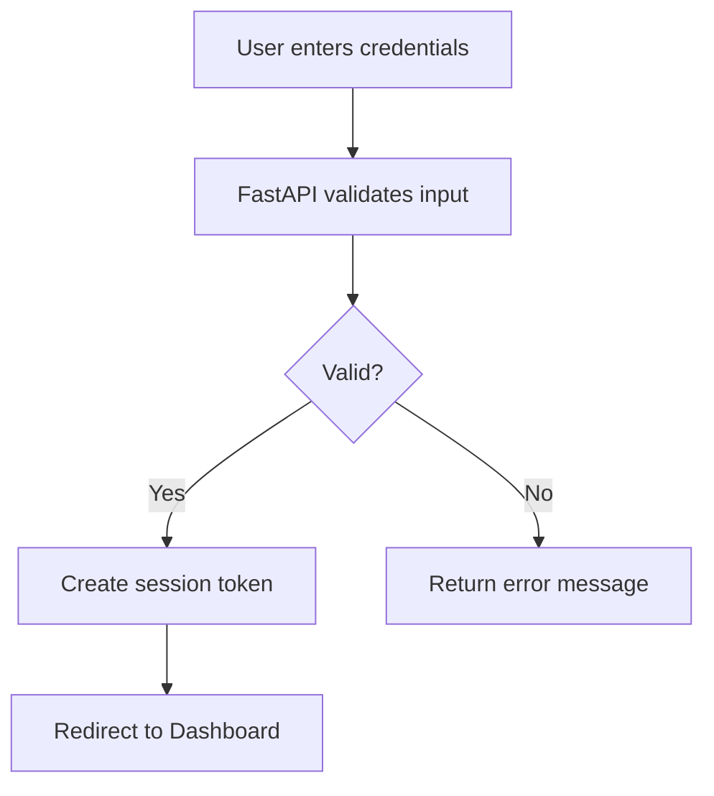
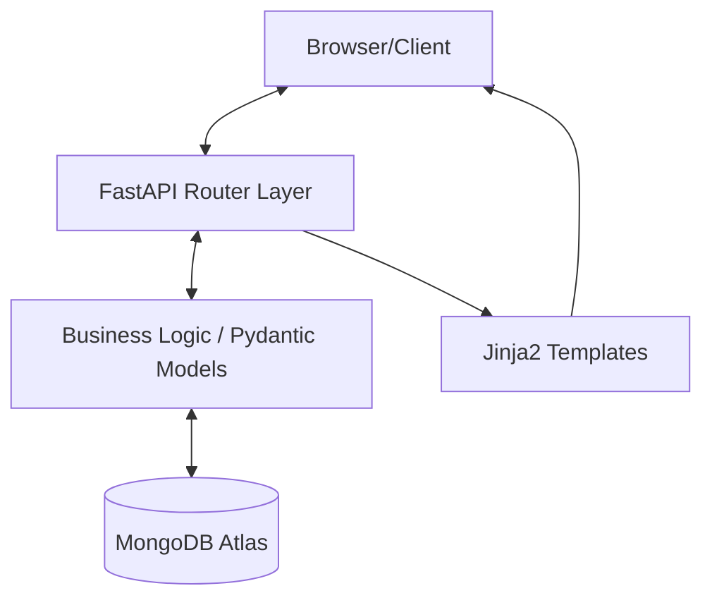

# Client Management System (CMS)

## Table of Contents
- [Introduction](#introduction)
    - [Executive Summary](#executive-summary)
    - [Key Features](#key-features)
- [Technology Stack](#technology-stack)
- [Project Structure](#project-structure)
- [Installation & Setup](#installation--setup)
    - [Prerequisites](#prerequisites)
    - [Step-by-Step Setup](#step-by-step-setup)
- [Running the Application](#running-the-application)
- [Data Flow & Architecture](#-data-flow--architecture)
    - [Data Flow Diagram (DFD)](#data-flow-diagram-dfd)
    - [System Architecture](#system-architecture)
- [Database Design](#database-design)
- [API Documentation](#api-documentation)
- [Security Measures](#security-measures)

---

## Introduction

### Executive Summary
The **Client Management System (CMS)** is a robust, web-based business automation solution designed to streamline the management of client profiles, project transactions, and financial records. Built with **FastAPI** and **MongoDB**, it offers a secure, real-time platform for businesses to track their operations and financial health.

### Key Features

- **Client Management**: Full CRUD operations for client profiles, including contact details and project info.
- **Transaction Tracking**: Detailed logging of payments, automated calculation of outstanding balances (due), and payment history.
- **Real-time Dashboard**: Comprehensive overview of total clients, total project value, total paid, and total due.
- **Secure Authentication**: JWT-based authentication with secure cookie storage and password hashing.
- **Automated Invoicing**: Dynamic generation of client-specific transaction records and status.
- **Advanced Filtering**: Search and filter clients by name, phone, or payment status (Pending/Completed).

---

## Technology Stack

- **Backend**: FastAPI (Python)
- **Database**: MongoDB Atlas (NoSQL)
- **Database Driver**: Pymongo (Synchronous with srv support)
- **Authentication**: JWT (JSON Web Tokens), Passlib (Bcrypt)
- **Templating**: Jinja2
- **Frontend**: HTML5, TailwindCSS (via CDN), Vanilla JavaScript
- **Environment Management**: Python-dotenv

---

## Project Structure

```bash
ClientManagement/
├── routers/                # API route handlers
│   ├── auth.py             # Login/Logout and token management
│   ├── clients.py          # Client CRUD and summary statistics
│   └── transactions.py     # Payment recording and history
├── static/                 # Static assets (CSS, images)
├── templates/              # Jinja2 HTML templates
├── database.py             # MongoDB connection and session management
├── main.py                 # Application entry point and middleware
├── models.py               # Pydantic data models
├── security.py             # Security utilities (hashing, JWT)
├── requirements.txt        # Project dependencies
├── .env                    # Environment variables (not tracked in Git)
└── README.md               # Project documentation
```

---

## Dependencies
```bash
dnspython==2.6.1
gunicorn==23.0.0
email-validator==2.3.0
python-multipart>=0.0.9
```

---

## Installation & Setup

### Prerequisites
- Python 3.9+
- MongoDB Atlas account (or local MongoDB instance)

### Step-by-Step Setup

1. **Clone the Repository**
   ```bash
   git clone <repository-url>
   cd ClientManagement
   ```

2. **Create a Virtual Environment**
   ```bash
   python -m venv venv
   source venv/bin/activate  # On Windows: venv\Scripts\activate
   ```

3. **Install Dependencies**
   ```bash
   pip install -r requirements.txt
   ```

---

## Running the Application

Start the development server using Uvicorn:

```bash
uvicorn main:app --reload --port 8000
```

The application will be available at `http://127.0.0.1:8000`.
- **Admin Dashboard**: `http://127.0.0.1:8000/admin`

---

## Data Flow & Architecture

### Login Flow


### System Architecture



### Data Flow Diagram (DFD)

#### 1. Authentication Flow
1. User submits credentials via the Login Page.
2. `auth.py` verifies the username and compares hashed passwords using `security.py`.
3. Upon success, a JWT token is generated and stored in a secure `access_token` cookie.
4. Middleware in `main.py` validates this cookie for all protected routes.

#### 2. Transaction/Payment Flow
1. User initiates payment for a client.
2. `transactions.py` (POST) receives the amount.
3. System fetches current client data, increments `paid`, decrements `due`, and updates `payment_status`.
4. A new entry is appended to the `payment_history` array within the client document.
5. Redirects user to the updated view.

---

## Database Design

The system uses a single database `clientms_db` with the following primary collections:

1. **users**: Stores administrative credentials (username, hashed_password).
2. **ClientMS**: (Collection Name) Stores client documents including:
   - Profile information (Name, Phone, Email, etc.)
   - Project details (Project Name, Category)
   - Financials (Total Amount, Paid, Due, Status)
   - `payment_history`: An array of objects (amount, timestamp, notes).

---

## Security Measures
- **Password Hashing**: Uses `passlib` with `bcrypt` for secure storage.
- **JWT Authentication**: Secure stateless authentication using JSON Web Tokens.
- **HttpOnly Cookies**: Prevents XSS-based token theft by storing the JWT in an HttpOnly cookie.
- **Input Validation**: Strict schema enforcement using Pydantic models.

---

## Contributing

Contributions are welcome! Please feel free to submit a pull request.
- Fork the project.
- Create your feature branch
- Commit changes
- Push
- Open a Pull Request

---

## Contact

E-mail: tushar.shihab13@gmail.com <br>
More Projects: 👉🏿 [Projects](https://github.com/tshihab07?tab=repositories)<br>
LinkedIn: [Tushar Shihab](https://www.linkedin.com/in/tshihab07/)

---

## License

This project is licensed under the [MIT License](LICENSE).